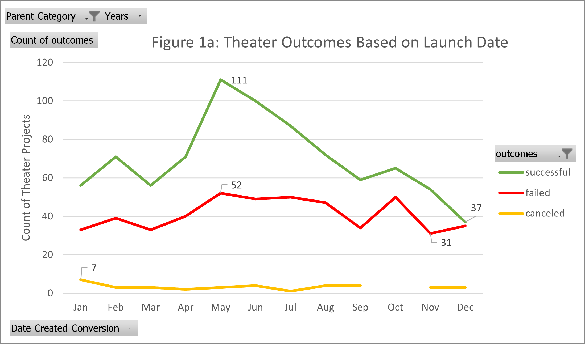
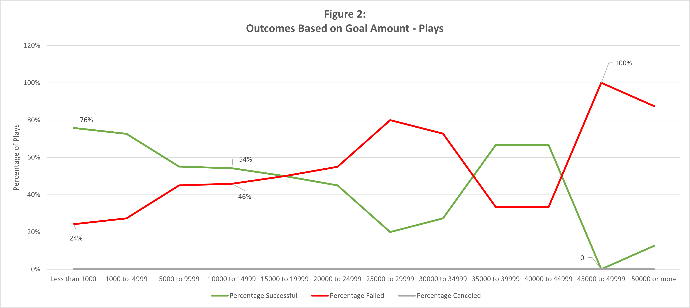

# Kickstarting with Excel

## Overview of Project

 A Playwrite named Louise is looking to kickstart a crowdfunding campaign to raise over $10,000 for her original play, *Fever*. To improve her likelihood of a successful campaign, Louise requested a thorough analysis of recent crowdfunding data to identify specific factors that can positively affect outcomes. A campaign is considered to have a *Successful* outcome if the funding goal is met while the campaign is active. Crowdfunding campaigns that do not meet their prescribed goal amounts or are canceled  

### Purpose

This analysis aims to identify and visualize any relationships that may exist between theater-based crowdfunding campaigns and its outcome. The independent variables measured in this analysis include:

1. If any relationship(s) exist between a crowdfunding campaign's Launch Date and its outcome as *Successful*, *Failed*, or *Canceled*.
2. What, if any, relationship(s) exist between a crowdfunding campaign's goal amount and its outcome as listed above. 

## Analysis and Challenges

The *Kickstarter* dataset contained detailed information for 4,115 crowdfunding campaigns. These campaigns, which were launched between 2009 and 2017, were froma variety of *parent-* and *subcategories*, including "theater" and "plays," for example. The dataset also provided important information like the *goal* amount, amount *pledged*, launch date, deadline, and numerous other variables.  

### Analysis of Outcomes Based on Launch Date

The first analysis was performed by creating a PivotTable that relates the a campaign's launch date to its outcome as *Successful*, *Failed*, or *Canceled*. This was done by creating the pivot table in the Worksheet named *Theater Outcomes by Launch Date.* The PivotTable was created by filtering for the campaign's *Parent Category* and the *Year* in which it was launched. The Rows were set to *Date Created Conversion*, displaying the month in which theater campaigns were launched between 2009 and 2017 . The Columns were set to *Outcomes*, with values being the count of each *Successful*, *Failed*, or *Canceled* outcomes. Live outcomes were specifically filtered out since they have neither succeeded nor failed. See **Table 1a** for the PivotTable showing Theater Outcomes Based on Launch Date.


**Table 1a** indicates that between 2009 and 2017, 1369 theater campaigns were launched. The month of May comprised the highest number of *successful* (111), *failed* (52), and *total* (166) campaign launches while the month of January showed the highest number of *canceled* (7) campaign launches. The month of December showed both the lowest count of *successful* campaigns (37) and the lowest count of *total* campaign launches (75). November shows the lowest count of campaign failures (31) and October shows the lowest number of canceled campaigns (0). See **Figure 1a** for a PivotChart detailing Theater Outcomes based on Launch Date.



The graph in **Figure 1a** would suggest that the month of May is the most successful of the year. However, since the total number of campaigns does not remain constant from month to month, it may be beneficial to visualize the data in Table 1a using percentages for *successful*, *failed*, or *canceled* outcomes. See **Table 1b** for the table converting Outcome Counts to Outcome Percentages and **Table 1c** for Summary Statistics for Theater Outcomes based on Launch Date.


By converting the data from counts to percentages, the monthly rate of success can more accurately be visualized. The month with the highest rate of *successful* outcomes is May (66.87%) while the month with the lowest rate of *successful* campaigns is December (49.33%). The month with the highest rate of *failed* outcomes is December (46.67%) while the month with the lowest rate of *failed* campaigns is May (31.33%). The month with the highest rate of *canceled* outcomes is January (7.29%) while the month with the lowest rate of *canceled* campaigns is October (0.00%)
On average, there were 68 (60.56%) *successful* campaigns with a standard deviation of 20 (4.39%) per month, 40 (36.53%) *failed* campaigns with a standard deviation of 8 (4.24%) per month, and 3 (2.91%) *failed* campaigns with a standard deviation of 1 (1.79%) per month. 

See **Figure 1b** for a combined Bar/Line chart comparing Outcome counts and Outcome percentages.


The graph in **Figure 1b** suggests that the dramatic increase in the **Count** of *successful* campaigns between April (71) and May (111) is not as drastic when comapring the **Percentage** of *Successful* campaigns for the same months, 62.83% to 66.87% respectively.

### Analysis of Outcomes Based on Goals

The second analysis aims to identify any relationships that exist between a crowdfunding campaign's goal amount and its outcome as *successful*, *failed* or *canceled*. While the first analysis looked at crowdfunding campaigns within the "Theater" *parent category*, the second analysis focuses on the *subcategory* named "plays".

This analysis was performed by creating **Table 2a** found in the *Outcomes Based on Goals* worksheet of the *Kickstarter* dataset.


The first column *Goal Buckets* contains buckets delineating ranges of goal amounts, which are necessary in the function below:

```
=COUNTIFS(Kickstarter!F:F,"successful",Kickstarter!D:D,">=1999",Kickstarter!D:D,"<=4999",Kickstarter!R:R,"plays"))
```

The `=COUNTIFS` function allows excel to count the number of entries that meet all of the criteria contained in the formula above.
The `Kickstarter!F:F, "successful"` criterion indicates that only successful campaigns are included
The `Kickstarter!D:D, ">=1999"` criterion indicates that only campaigns with goal amounts above $1,999 are included
The `Kickstarter!D:D, "<=4999"` criterion indicates that only campaigns with goal amounts below $4,999 are included
The `Kickstarter!R:R,"plays"` criterion indicates that only campaigns from the subcategory "plays" are included.

This formula must be augmented to ensure that the correct *outcome* criteria and *goal* amounts are included for each *goal bucket*.

Once *successful*, *failed*, and *canceled* campaign counts were tabulated for each goal bucket, the percentages of each outcome were calculated and visualized in a line graph. See **Figure 2** for *Outcomes Based on Goal Amount*.



The Graph in **Figure 2** shows that campaigns with goal amounts less than $1,000 had the highest rate of success (76%) and the lowest rate of failure (24%). Campaigns with goal amounts between $45,000 and $49,999 had the lowest success rate (0%) and the highest failure rate (100%). No crowdfunding campaigns within the "Plays" *subcategory* were canceled, regardless of goal amount.

### Challenges and Difficulties Encountered

The dataset required a significant amount of cleaning before analysis. For example, the campaign launch date was encoded in a Unix timestamp, which is not readable by excel. This required a conversion using the formula below:
'''
=J2/86400 + DATE(1970,1,1)
'''
Where cell `J2` represents the Unix-time of the campaign's launch

Additionally, the parent/subcategory column had to be split to allow for filtering based on *parent* or *subcategory*. This was done by using the *Text to Columns* feature in Excel.

## Results

### What are two conclusions you can draw about the Outcomes based on Launch Date?

1. Louise should launch her crowdfunding campaign during the months of February-July, September, or November, since these months show a greater-than-average success rate for theater campaigns. If she submits here campaign in May, she will have the highest chance of success. 
2. December is the month with the highest rate of failure, and Louise should avoid launching her campaign since it may reduce her chances of success. While the data does not indicate any specific reason as to why campaigns launched at this time of the year are less successful, one may assume that the holiday season likely plays a role.

### What can you conclude about the Outcomes based on Goals?

Campaigns with lower goal amounts tend to be more successful than campaigns with higher goal amounts. Louise may want to consider finding other sources of funding so she can lower her goal amount. The data indicates that plays with goal amounts around $10,000 have relatively similar rates of success (54%) and failure (46%). I would recommend that Louise reach out to the venue and see if she can work out a deal to improve her budget, lower her goal amount, and increase the likelihood of a successful campaign.

### What are some limitations of this dataset?

The dataset does not indicate why certain campaigns are successful or not.

### What are some other possible tables and/or graphs that we could create?

Other possible tables/graphs include: 
- *Percentage Funded* vs *Goal Amount* 
- *Percentage Funded* vs *Number of Backers*
- *Goal Amount* vs *Average Donation*
- *Average Donation* vs *Outcome* 